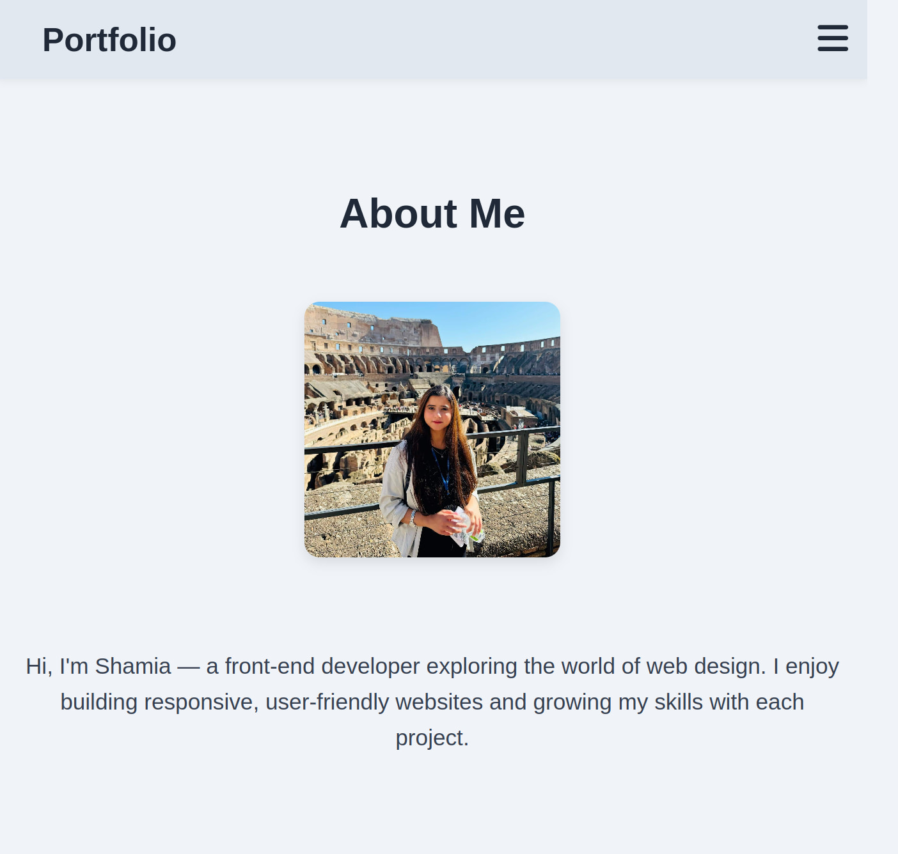

#Frontend Portfolio


A single-page portfolio website showcasing selected frontend development projects.

## 📄 Description

This portfolio was created as part of the Noroff Frontend Developer Programme.  
It displays three major projects completed so far, along with reflections and areas for improvement.

## 💼 Projects Included

- **Rainydays** – Cross Course Project  
- **Community Science Museum** – Semester Project 1  
- **Green Gourmet** – Exam Project 1

## 💡 What You’ll Find on the Portfolio Page

Each project card showcases:
- A project title
- A brief description
- A thumbnail image
- A link to the GitHub repo
- A link to the live demo

## 🔧 Built With

- HTML5  
- CSS3 (No frameworks)  
- JavaScript (Vanilla)

## 🚀 Getting Started

To run the portfolio locally:

1. Clone the repository:
```bash
git clone https://github.com/shamia702/your-portfolio-repo.git
